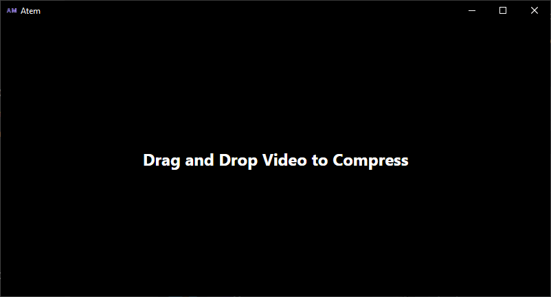

# Atem

A program which compresses your discord videos to under 8megs. Just drag and drop a video and it will be compressed.

## Download

Head over to the [releases](#) page. Linux + Mac builds coming soon.

## Bugs
- Sometimes videos can't be converted to under 8mb. (currently audio isn't compressed but that might be a fix)

## TODO

- support for multiple files
- progress bar (maybe)
- back button everywhere

## developing

First go to https://ffbinaries.com/downloads and download both ffmpeg and ffprobe.

Then run `$ target=rustc -Vv | grep host | cut -f2 -d' '` to view your rust toolchain target.

Extract them to the following folders:
`project_dir/src-tauri/ffmpeg/ffmpeg-$target`
`project_dir/src-tauri/ffprobe/ffprobe-$target`

`chmod +x` both of them (if you're on linux)

where target is the output of the rust toolchain command

then run

`yarn tauri dev`

script coming soon

## why the name?

8m -> atem

## Recommended IDE Setup

- [VS Code](https://code.visualstudio.com/) + [Tauri](https://marketplace.visualstudio.com/items?itemName=tauri-apps.tauri-vscode) + [rust-analyzer](https://marketplace.visualstudio.com/items?itemName=rust-lang.rust-analyzer)
